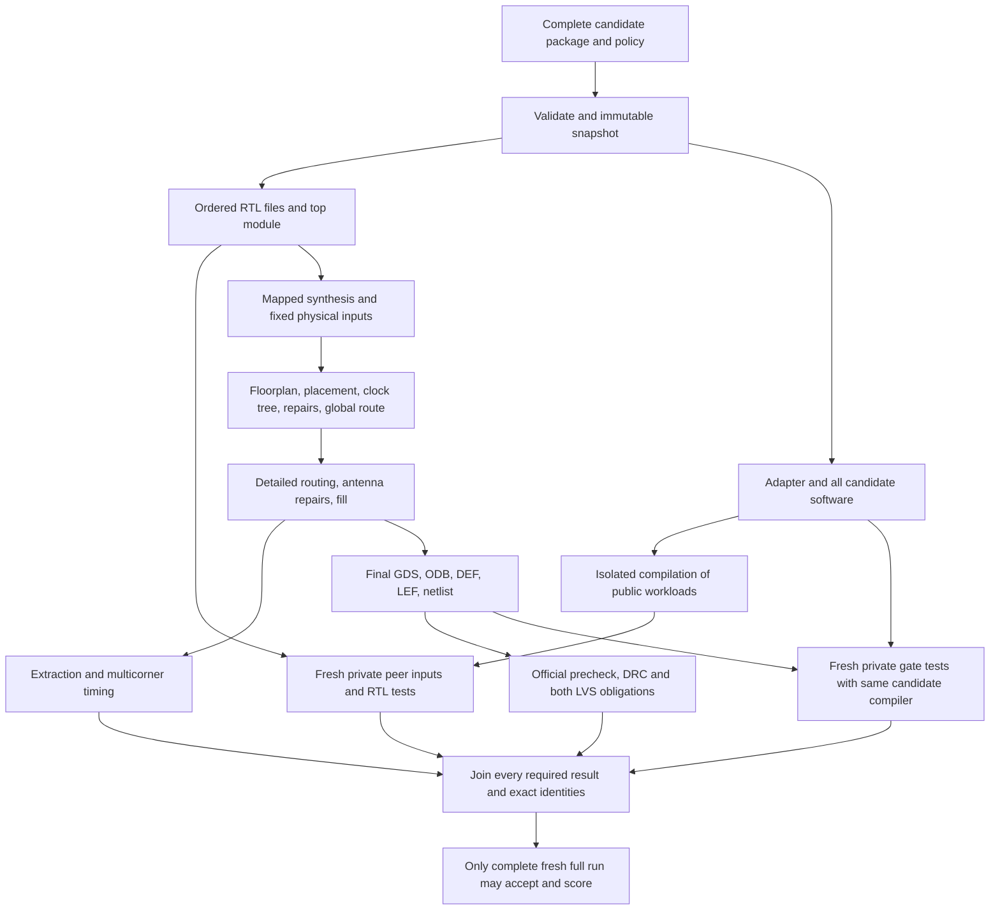

# Change-aware feedback investigation

Investigation at accepted commit `9a3329419eb4859fc5ae230c21824c3bbd8e6f72`,
September 29, 2026. Work is isolated on `codex/incremental-verifier-001`.
No candidate, verifier, workload, score, constraint, tool pin or official deck
was changed. No physical jobs, cloud jobs or private runtime artifacts were
used. Measurements below come from completed public evidence and completed
physical-stage reports.

**Useful feedback within 15–20 minutes is feasible as a budgeted provisional
observation, not as a guaranteed full signoff latency.** Run fresh fast checks
first, then report the latest completed early physical stages by the budget.
Complete unchanged full verification before accepting or ranking a candidate.

## Measured budget and proposed loop

The accepted [parallel validation](../reports/parallel-validation.json) records
these cumulative tool times. They exclude setup, controller transitions,
functional checks, queueing and observer overhead; they are not a latency SLA.

| Completed milestone | Cumulative tool time | Useful observation |
|---|---:|---|
| Technology-mapped synthesis, step 6 | 1m34s | Mapped implementation exists; later area/timing can change |
| Initial STA, step 12 | 1m59s | Early timing model |
| Global placement, step 28 | 2m15s | Placed area/utilization estimates |
| Timing after CTS repair, step 38 | 4m55s | Clock-tree/repair cost and that stage's timing |
| Global routing, step 39 | 5m00s | Estimated route length and vias |
| Post-global-route timing, step 44 | **6m13s** | Preferred early physical feedback barrier |
| Detailed routing, step 45 | 29m53s | Detailed routing alone adds **23m40s** |
| Routed multicorner timing, step 56 | 31m01s | Extracted post-route timing |
| Sealed layout, step 61 | 33m12s | Inputs to independent final physical checks |
| Entire accepted evaluation | **100m47s** | Full technical acceptance |

A separately profiled fresh fast run took **28.0 seconds**, including all
43 workloads/75 RTL stages; its generic synthesis took 4.4 seconds. Those
[historical measurements](../reports/performance-audit.json) used this Mac and
do not guarantee a new candidate's runtime. The parent investigator additionally
reported a changed candidate spending **19m31s in global routing alone** on
the contended Mac. This investigation did not inspect that active run.

Recommended product behavior:

1. Return the fresh fast result as soon as it completes. Keep `accepted: false`
   and `score: null`; expose generic size and individual functional failures.
2. For candidates worth physical work, start a fresh physical evaluation with
   the existing pinned flow. Aim to observe completed step 44, but publish the
   greatest completed prefix available at 15 minutes and again at 20 minutes.
   If a stage is still running, report it pending and show older measurements
   with their exact stages. Never infer completion from a file's existence.
3. Retain full signoff for selected improvements. A full run already in progress
   can continue under its original deadline. If an organizer cancels it to save
   compute, it stays unaccepted and a later promotion requires another fresh
   full run. Cancellation must use the owning runner's cleanup path.

The observer below implements read-only step 2 reporting. It does **not** add a
new early-stop runner, scheduler, job deadline, cancellation path or resumable
cache. Reading early feedback from an existing full run saves response latency;
it does not itself reduce the total compute that run consumes. A dedicated
provisional flow ending after step 44 is a possible follow-up requiring owned
process cleanup and differential tests, without changing the full command.

## Dependency map



The tool image, PDK/library bytes, helper code, constraints, templates, flow
configuration, execution parameters and verifier logic are dependencies of
their consuming nodes even where omitted from this diagram. Library or rule
changes can affect several branches at once.

## Invalidation matrix

This matrix describes dependency reasoning, not permission to skip the current
full contract. Every changed candidate package still requires its own fresh
full evaluation for promotion.

| Change | Checks/calculations that must be reconsidered | Potential reuse for provisional analysis only |
|---|---|---|
| RTL bytes, top module, ordered RTL list, widths or reset behavior | Source validation, synthesis, all functional tests and every downstream physical/signoff artifact | Immutable tool/PDK downloads only; no locality assumption |
| Adapter, assembler, firmware, host action encoding or captured data mapping | Source validation, every affected compiler request, all fresh private RTL and gate tests | Physically identical RTL could refer to an older exact physical implementation, clearly labeled historical |
| Documentation, license or NOTICE only | Full package identity, policy/license validation and admission | Physical/functional behavior may be unaffected, but an older accepted source identity is not this package |
| Public workload or public seed | All adapter responses, generated harness and functional runs | Physical inputs may be unchanged; verdicts cannot be relabeled as new tests |
| Private peer seed or independent trial | Rebuild the trusted testbench and rerun RTL/gate simulation | No private-test verdict, testbench or nonce reuse |
| Tool image, libraries/PDK, support commit, constraints, flow config, execution seeds/threads/platform | Every consuming stage and descendants, including area/timing/layout and decks where applicable | Only objects whose complete dependency closure remains identical |
| Official deck or precheck/LVS wrapper | Changed checker and its exact artifact/dependency inputs | Earlier layout might remain an input, but no old check outcome implies the new check passed |
| Verifier/adapter contract/scoring policy | Harness identity, admission and every affected stage | Historical evidence retained under its original identity only |
| Any cached output, manifest, referenced dependency or provenance mutation | Reject cache/observation; never promote damaged evidence | None until recomputed or recovered from trusted immutable storage |

Physical change propagation is global. A one-bit RTL change can change
synthesis mapping, fanout, placement, buffering, clock trees and routes far
from the edited logic. Connectivity-sensitive DRC, LVS and parasitic timing
cannot be reduced to the source diff or a layout bounding box. Routing an ECO
is a tool capability, not proof that all affected obligations have been covered.
No regional checker substitution is justified by the available evidence.

## What can safely be cached

**Already sound and implemented:** immutable image layers, checksum-pinned
downloads and verified PDK/helper repositories. Recheck integrity before use;
the measured cost is small. Do not save milliseconds by dropping those checks.

**Possible future deterministic artifact reuse:** a content-addressed object
can remain an input to a provisional experiment when every byte and execution
dependency that produced it is identical and its outputs are rehashed. This
does not produce a fresh test verdict, and it does not meet the current
`fresh_artifact_provenance` obligation. `run_physical` currently requires an
empty output directory and explicitly forbids checkpoints.

A conservative future key would be a domain-separated hash of canonical JSON
containing the cache schema, producer stage/version, ordered input paths and
byte hashes, producer commands and generated config/script bytes, environment,
image digest, exact tool/helper/PDK/deck identities, execution platform,
threads/seeds, and parent output hashes. Store output path/type/size/hash and a
successful completion manifest written atomically by the trusted controller.
Never key on mtime, file names alone, Git commit alone, scalar cell count, a
reported score, or an unchecked participant-supplied digest. Conservative
absolute-path dependencies may reduce hits; path normalization needs a
separately reviewed canonical virtual layout, not arbitrary string removal.

Even byte-identical netlists are insufficient by themselves: placement also
depends on physical libraries, constraints, templates, pin assignments and
execution state. Equivalent behavior does not imply identical placement or
timing. Normalizing timestamps for a comparison, as the historical GDS report
does, is not permission to replace the raw-byte identity checks used in signoff.

Cache directories would belong to the organizer; candidate containers would
receive only immutable verified inputs, separate fresh scratch, no cache index,
credentials or Docker socket, and their existing limits. Prevent partial
publication, symlink traversal, poisoned failure entries, concurrent overwrite,
cross-tenant data exposure and unbounded disk retention. Cancellation/failure
must never write a success entry. A malicious candidate might exploit tool
state or nondeterminism, so do not assume arbitrary adapter execution is a pure
function just because its input JSON matches. This prototype caches nothing.

Compiler/firmware-only changes illustrate the distinction: the current flow
consumes the explicit RTL list and trusted configuration, so unchanged RTL
can have unchanged physical dependencies. The new compiler still needs all
fresh tests. Current service admission binds the **whole** candidate hash map,
current verifier identity and requested seed to mandatory stage results.
An accepted result from the earlier package cannot be copied across that
boundary. Any future incremental-acceptance contract would require separate
authorization, design review and new baseline admission; none is proposed here.

## Read-only prototype

From this isolated worktree, inspect an organizer-owned evaluation:

```sh
python3 -B scripts/provisional_feedback.py \
  --evaluation /ABSOLUTE/PATH/TO/EVALUATION \
  --candidate candidates/tempo
```

The script writes JSON to stdout only. Its statuses are `pending`,
`feedback_available` or `feedback_unavailable`, always with `accepted: false`
and `score: null`. Exit 0 means an observation was obtained, not that a design
passed. Do not use this command as Yukon's benchmark command or service
acceptance path. The full command is unchanged.

It compares the recorded source/harness identities with the current candidate,
immutable candidate snapshot and current verifier, and requires previously
completed synthesis and RTL checks in that same evaluation. It reads the
contiguous pinned prefix through step 44 only after each stage has a complete
`runtime.txt` marker and valid `state_out.json`. The current pinned flow writes
that marker after validating and closing its output state; this is the same
completion barrier used by `seal_completed_artifacts`. It hashes and rereads
all consumed evidence, revalidates sources/harness, rejects symlinks, bounds
file reads, and refuses failed/blocked runs. A concurrent report update can
produce `feedback_unavailable`; retry after the writer completes.

The observer reads **direct** `or_metrics_out.json` values rather than inherited
`state_out.metrics`. Every value carries its source stage, path and SHA256.
Only corners present in the latest completed STA stage's direct file are
shown. Duplicate direct-metric keys are omitted and listed, including equal
duplicates; metadata duplicates are rejected. It never reads private replay
seeds, generated testbenches, adapter actions, netlists, GDS or active jobs for
this investigation. Its output is evidence interpretation within the trusted
organizer filesystem, not authentication of reports supplied by an attacker.

This matters in the accepted baseline: inherited step-44 metrics contain fast
and slow setup slacks of approximately −1.94 ns and −28.53 ns from prior work,
while its direct file freshly reports only typical-corner +8.47088 ns. The
observer omits those stale corners. It reports directly measured standard-cell
area **515,005 µm² from step 41**, retaining that provenance, versus the final
accepted **515,364 µm²** (0.070% larger). Step-44 inherited area is 515,222 µm²;
the observer does not pretend it measured that directly. Step-56 total instance
area includes fill and is not interchangeable with the ranked non-fill area.
These are one candidate's observations, not validated error bounds. Route
length/vias are useful feedback; this prototype does not infer a congestion
score from them.

## Validation and limits

The bounded prototype tests use local fixtures only. They cover completion
prefixes, half-written/missing markers, duplicate stages/keys, malformed and
oversized data, nonfinite numbers, changed source/snapshot/harness, symlink
escapes, concurrent mutation, failure/blocked states, stale timing corners,
read-only behavior and refusal to reissue an accepted result. The actual
completed parallel baseline was also observed without running any EDA tool.
Commands, counts and measured observation time are recorded in
[incremental-verification.json](../reports/incremental-verification.json).

Remaining work before a deployed budgeted-feedback feature: connect the
observer to organizer-owned job progress, add periodic publication/deadline
behavior with cancellation ownership, measure the distribution across real
candidate edits and host loads, and define an early-stop provisional runner
only if saving total compute warrants it. No 15–20 minute full-acceptance claim,
cache admission, cloud deployment or new accepted candidate resulted here.
