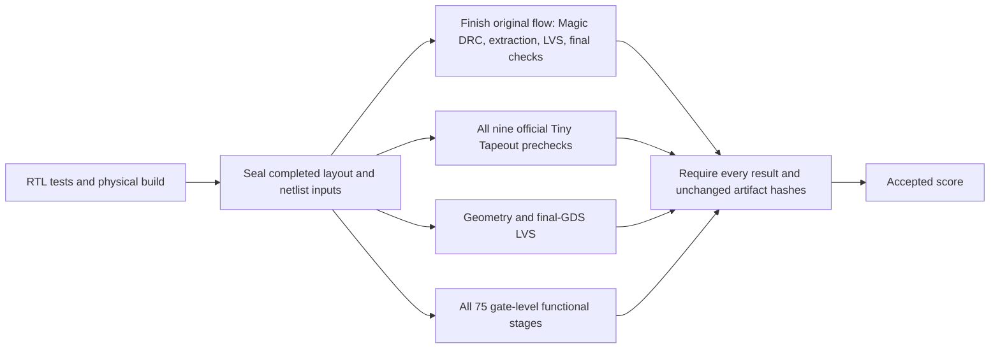

# Verification performance audit

Audited September 28, 2026 at commit
`10cec72b96e5030239ad76d17aa8abe0b4ce4731`. The production verifier, candidate,
acceptance rules and accepted baseline remain unchanged. Measurements and
experiment results are in [performance-audit.json](../reports/performance-audit.json).

## Findings

There are substantial scheduling bottlenecks. The strongest opportunities are
concurrent independent layout checks and bounded concurrent compiler requests.
Neither requires reducing protocol coverage or removing a physical check.
Correctness of a production implementation still requires differential tests,
failure/cleanup tests and a fresh full baseline run.

| Work | Measured time | Finding |
|---|---:|---|
| Complete accepted full run | 118.8 min | Existing baseline, Apple Silicon with the pinned amd64 Docker image |
| Magic DRC | 32.6 min | Approximately 100% average CPU utilization: one core |
| Official CMOS5L KLayout DRC | 40.3 min | 36 min 20 s between connectivity-setup and rule-evaluation log markers |
| Detailed routing | 24.2 min | Approximately 385% average CPU utilization: nearly four cores |
| Final-GDS LVS | 5.2 min | Scheduled after the entire official precheck |
| Fresh profiled fast run | 28.0 s | Passed all 75 functional stages; still correctly unaccepted in fast mode |
| Compiler calls within that fast run | 17.5 s | 43 serial isolated invocations; about 63% of fast runtime |

The two DRC checks account for **61.4% of full runtime**. Their execution
overlaps in neither the current CLI nor the current physical wrapper.

These numbers distinguish measured tool runtime from profiling and estimates.
Physical times come from LibreLane runtime/process-stat files, the official
precheck XML, and the final-GDS LVS log. The compiler profile includes adapter
execution, Docker launch/cleanup, waiting and JSON handling; it is not a
measurement of Docker startup alone. Runtime will vary with the candidate,
host and competing workloads.

## 1. Overlap independent physical and gate checks

In the accepted run, the final GDS, netlist, ODB, DEF and LEF bytes were all
already present at the completion of step 61 (`Magic.WriteLEF`). I compared
their SHA256 values with the final accepted artifacts: all five match.
Nevertheless, the wrapper waits for the remaining Classic flow, then runs the
official precheck, geometry validation, GDS LVS and gate verification serially.

A proposed schedule, retaining every existing check, is:

Using the original measured durations without contention, this gives an
**idealized 76-minute critical path**, versus 119 minutes today: about 43
minutes saved. This is a scheduling estimate, not an implemented or measured
optimized full run. The original full evaluation overlapped another diagnostic
run for part of its duration; its per-stage times are not an isolated hardware
benchmark.

The implementation must use completed-stage signals and immutable copies,
not the appearance of a partially written file. Every branch must have its
own writable scratch and reports, read-only inputs, bounded resources and
tracked processes. At the final join, require successful completion of the
original flow and every extra check, and compare the sealed input hashes with
the final artifacts. Missing, failed, cancelled or timed-out branches must
never produce an accepted score.

The existing `run()` closure cannot simply be called from several threads:
it updates `commands[-1]` and shares cleanup state. Refactor that ownership
before introducing concurrent physical jobs. Also enforce an aggregate
resource budget: four simultaneous containers each allowed 16 GiB can consume
64 GiB. Existing per-container limits are not a shared per-evaluation limit.

A smaller first change could overlap only the post-flow precheck, final-GDS
LVS and gate tests. This leaves Classic flow scheduling intact and could hide
roughly nine minutes of current serial work; it has a smaller integration
surface than starting checks during the flow.

## 2. Compile public workloads concurrently

A separate experiment ran the same 43 requests through four spawned worker
processes, each using the existing isolated compiler and its own directories.
It reduced compiler wall time from **17.51 s to 5.21 s**. All returned actions
matched the serial run exactly. The unchanged functional verifier then passed
all **75 stages and 48,775 assertions** with fresh private inputs.

Replacing only that component in the measured fast profile suggests about
**15.7 seconds for fast mode**, versus 28 seconds. That whole-pipeline speedup
has not been integrated or measured. The experiment validates a successful
baseline only; it does not establish concurrent failure, timeout or
cancellation correctness.

Preserve one isolated container per request, deterministic request ordering,
unique output directories, per-request limits, and bounded aggregate workers.
Private peer inputs must still be generated only after every compiler has
finished. Test failure and timeout in each worker position and confirm all
containers are removed before returning.

Use spawned processes or first redesign the launcher: it currently uses
`preexec_fn`, which Python documents as unsafe in a process containing threads.
Blindly wrapping `compiler()` in a thread pool risks deadlock. See the
[Python subprocess documentation](https://docs.python.org/3/library/subprocess.html#subprocess.Popen).

## 3. Match CPU allocation to the actual stages

The physical wrapper accepts a `jobs` setting up to 64 but hardcodes Docker's
CPU allowance to four. The CLI currently supplies the default four. Increasing
OpenROAD threads alone therefore cannot grant more CPU capacity. Exposing a
consistent organizer-controlled setting could improve routing, but requires
scaling measurements and a new baseline because placement/routing execution
and results may change.

More threads are not a demonstrated solution to the long precheck. Its pinned
CMOS5L deck defaults to hierarchical mode; its thread log describes tiled-mode
capacity. The observed delay is global connectivity setup. KLayout documents
both hierarchy-related performance limits and semantic considerations when
tiling non-local operations. Changing modes or disabling connectivity checks
is not an established equivalent speedup. Keep the official deck unchanged.
See [KLayout's DRC documentation](https://www.klayout.de/doc-qt5/manual/drc_runsets.html).

Running the same pinned image natively on Linux x86-64 avoids architecture
emulation. The subsequent cloud measurement below did not improve full-run latency;
native execution alone is not a demonstrated speedup on this VM.
[Docker's documentation](https://docs.docker.com/build/building/multi-platform/)
describes the potential emulation cost for compute-heavy workloads.

## Native cloud measurement

The follow-up [cloud performance investigation](cloud-performance-investigation.md)
identifies the actual CPU topology, verifies identical physical artifacts, and
adds a matched in-memory geometry probe that corroborates slower per-thread
execution on the selected VM.

The unchanged Tempo candidate and verifier completed a full accepted run on a
`c3-standard-8` VM (8 vCPU, 32 GB RAM) in `us-central1`. The physical tool container
retained its four-CPU limit. The accepted area and score exactly match the original
baseline. See [service validation](../reports/service-validation.json) for the job,
release identities, artifact generation, and independently checked archive digest.

| Work | Earlier Mac run | Native cloud run |
|---|---:|---:|
| Fast verification | 28.0 s | 20.7 s |
| Full verification | 118.8 min | 146.3 min |
| Detailed routing | 24.2 min | 29.1 min |
| Magic DRC | 32.6 min | 42.8 min |
| Official CMOS5L KLayout DRC | 40.3 min | 49.8 min |

The cloud full run was **23.2% slower** in these observations. Both DRC checks
still consumed **63.3%** of its total time. Durable job publication, including
queue pickup and evidence packaging/upload, added about 20 seconds beyond the
verifier's runtime. The API-only admission update during the run changed no worker,
candidate, tool, or verifier files, and did not restart the full worker.

These are individual measurements with different runtime test inputs and early
overlapping diagnostic work, not a controlled CPU benchmark. The cloud service
establishes durable remote execution and measured fast-loop latency. Full-run
acceleration still requires the scheduling work described above; it has not been
implemented, and no acceptance obligation was removed.

## Work that is already inexpensive

The fresh profile spent about 0.032 s validating the candidate and 0.049 s
validating all adapter responses. Separate probes measured wheel integrity at
0.45 s, PDK integrity at 0.11 s, support integrity at 0.05 s, and one complete
output-budget scan at 0.023 s. Removing these checks would give negligible
speedup while weakening validation. The full run scans output budgets
periodically; the quoted figure is the cost of one scan on this baseline.

Keep both DRC engines, both LVS checks, all timing corners, all 75 functional
stages, source/artifact hashes, private-input generation and container
isolation. Cached tool/PDK downloads are already used. Do not substitute cached
candidate verdicts or synthesis area for fresh full acceptance.

## Recommended order

1. Integrate bounded compiler concurrency and per-stage timing metadata; run
   the existing negative controls plus concurrent failure/cleanup tests.
2. Overlap checks on immutable artifacts, initially after Classic flow, then
   evaluate the earlier artifact-release schedule. Run the complete baseline
   and inject failures into every branch before deploying the new scheduler.
3. Use the measured cloud baseline for routing CPU-allocation comparisons,
   retaining the official verification decks and obtaining a fresh full pass
   for each organizer-controlled execution change.

Finite testing cannot certify every future program or make a verifier
infallible. The preservation target is every existing acceptance obligation,
with no path to acceptance after incomplete checks. These experiments have not
changed the production verifier or superseded its accepted baseline.
